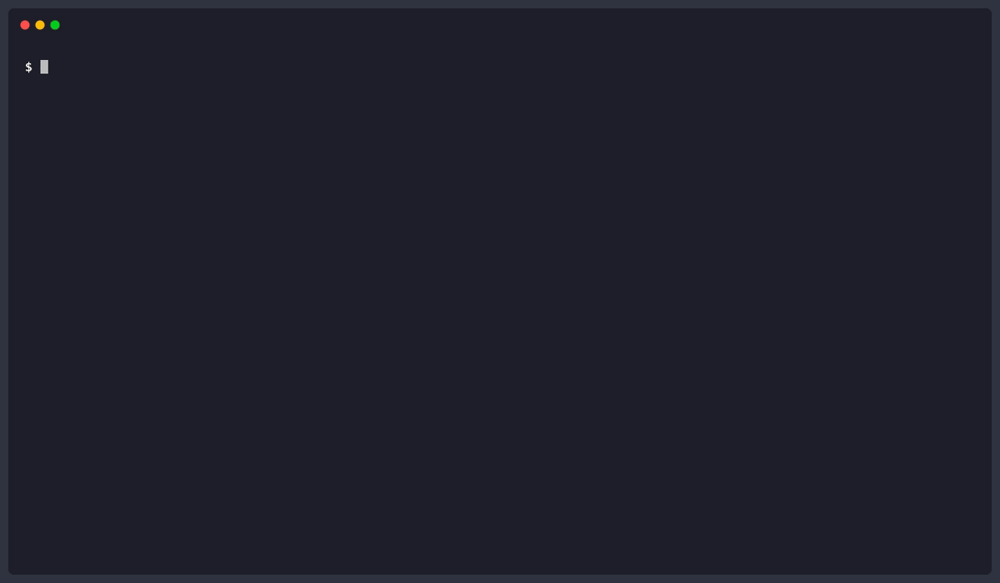
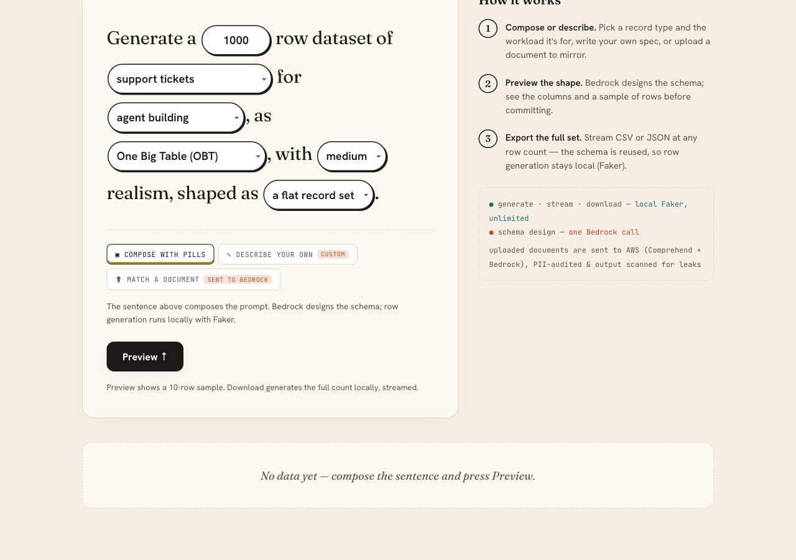
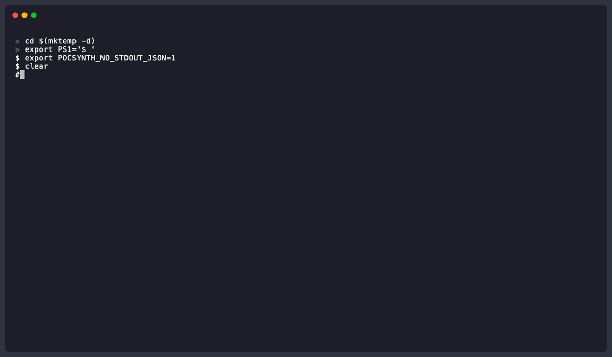
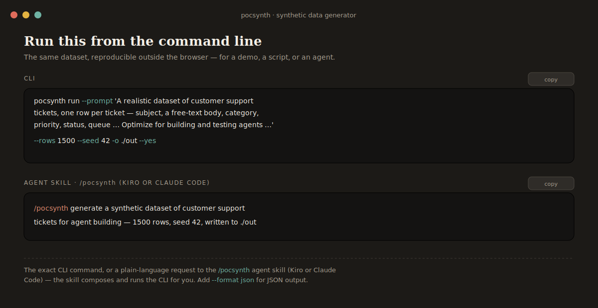

# PoC Accelerator Synthetic Document Generator

Turn a **reference PDF** — a compliant example contract, form, or statement to work with — into a **synthetic, shareable version** that keeps the structure and formatting but replaces prose and PII with realistic fakes, then scans the result for any PII that slipped through (Amazon Comprehend, written to a reviewable audit file).

Built for Solutions Architects and PoC engineers who need representative documents for demos, RAG eval corpora, model benchmarking, or partner handoffs — so you share a synthetic copy, not the source. Processing a document sends its contents to Amazon Bedrock and Comprehend **in your own AWS account**; only the synthetic output is meant to be handed off. Use reference or public material — not regulated data (PHI, PCI, etc.).



## What it does

Given an input PDF (say, `aws-mp-contract.pdf`), the tool produces:

- **`aws-mp-contract_cleaned.html`** — one synthetic document matching the original's layout, section structure, and table shapes, with prose rewritten and names/addresses/identifiers swapped for realistic fakes.
- **`aws-mp-contract_pii_scan_audit.csv`** — a CSV of every PII entity Comprehend found in the synthetic output (type, confidence, offset range, optional redacted/raw value).
- **Per-page HTML/PNG** — one file per page for diffing, spot-checks, or targeted re-runs.
- **`result.cost` block** — actual Bedrock + Comprehend $ spend for the run.

Under the hood: Amazon Bedrock (Claude Sonnet 4.6 default; Opus 4.6 or Haiku 4.5 selectable) + PyMuPDF + BeautifulSoup + Amazon Comprehend for the PII audit.

## Typical use cases

- **Partner handoff.** Take a reference contract, produce a synthetic version, and share the synthetic copy for workflow discussion. The source document is processed in your own AWS account (Bedrock + Comprehend); only the synthetic copy is shared onward.
- **RAG eval corpus.** Convert a set of reference PDFs into synthetic markdown documents, index them, and test retrieval quality without PII exposure.
- **Live demo prep.** Turn a reference loan application into a synthetic one for a live demo — same shape, zero real identifiers.
- **Model benchmarking.** Run the same document through Sonnet, Opus, and Haiku; compare cost + output quality.

## Multiple variants from one input

Pass `--num-docs N` to emit N independent synthetic rewrites of the same PDF — each variant has different fabricated names, addresses, URLs, etc. Useful for RAG eval corpora, A/B testing prompt changes, or handing a customer multiple shape-preserving samples from a single source.


```bash
# 3 independent synthetic variants
pocsynth convert contract.pdf --num-docs 3
# → contract_1/contract_cleaned.html
# → contract_2/contract_cleaned.html
# → contract_3/contract_cleaned.html
```

Each variant lands in its own directory with the same per-page structure; the PII audit is shared across all variants so you can review findings in one pass.

---

## Structured data pipeline

Beyond synthetic *documents*, `pocsynth` generates synthetic *tabular data* through a four-stage pipeline. It splits cleanly into a **paid half you run once** and a **free half you run unlimited times**:

```
extract  (paid)  PDF ─────────────► data sample (records / field observations) + PII audit
schema   (paid)  sample | prompt ─► generation-ready schema + data dictionary + lint report
            (free)  your schema ───► lint / document / --fix          (offline)
generate (free)  schema | preset ─► synthetic rows (CSV/JSON, typed, seeded, weighted enums)
test     (free)  rows + schema ───► validation report (exit 7 if invalid)
```

**The cost story:** extract a schema from **one** real PDF (one or two paid Bedrock calls), then `generate` thousands of rows for **free**, offline, forever.

```bash
# One-shot — the whole pipeline in a single command (safe-by-default):
pocsynth run --preset crm_contacts --rows 1000 --seed 42 -o ./out   # free, instant
pocsynth run --document report.pdf --rows 10000 --yes -o ./out      # paid; extract→schema→generate→verify, emits an Attestation

# Or drive the stages by hand —
# Fastest path — a bundled preset, zero AWS, instant:
pocsynth presets                                            # 15 record types: support_tickets, insurance_claims, financial_transactions, b2b_saas, …
pocsynth generate --preset crm_contacts --rows 1000 --seed 42 -o ./out
pocsynth test --rows ./out/rows.csv --schema ./out/schema.json

# From a natural-language description (one small paid call):
pocsynth schema --from-prompt "a B2B SaaS company's customer accounts with plan tier and MRR" -o ./out
pocsynth generate --schema ./out/schema.json --rows 5000

# From a reference document (the cost-saver):
pocsynth estimate report.pdf --for extract                 # offline cost gate
pocsynth extract report.pdf -o ./out                       # paid; PII-audited
pocsynth schema --from-sample ./out/sample.json -o ./out   # paid; review ./out/schema.md
pocsynth generate --schema ./out/schema.json --rows 10000  # free, unlimited
pocsynth verify --rows ./out/rows.csv --sample ./out/sample.json --schema ./out/schema.json  # prove no real PII leaked
```

**The generator is designed to keep real PII out of synthetic output, and `verify` scans to check — best-effort, not a guarantee.** `extract` audits the values it pulls (Amazon Comprehend, on by default), and `schema --from-sample` does not let a real PII value become an `enum` — PII fields are bound to Faker providers and the real values are discarded. `verify` then scans the generated rows and the schema for any real value that slipped through. Detection is best-effort (Comprehend + an exact-value scan) and may miss reformatted or unflagged values, so **review synthetic output before sharing it**; the extract sample and audit CSV are never safe to share.

**Determinism.** `--seed` makes generation byte-reproducible. **Distributions:** low-cardinality `enum` fields carry real-world frequency weights (inferred from the source document, model-proposed, or uniform — your choice via `--distribution`).

**Secure prototyping in 1 command.** One `run` verb serves two personas:
- **AWS SA (sandbox):** `run --preset … → done` — $0, synthetic by construction.
- **Customer-runner (own account):** `run --document … --yes → attestation for your reviewer` — fail-closed if a real value leaked.

### Demo UI

A local web UI (Metabase-style) ships behind an optional extra:



```bash
pip install 'pocsynth[ui]'
pocsynth ui                                                 # http://127.0.0.1:8000
```

Compose a dataset from pills (record type × scenario), describe one in your own words, or upload a seed document → preview 10 rows → download any size. Built with FastAPI + HTMX; calls the same core as the CLI.

Every preview also shows how to **reproduce the dataset outside the browser** two ways: the exact CLI command (`pocsynth run …`) and a plain-language **`/pocsynth` agent-skill request** (Kiro or Claude Code — the skill composes and runs the CLI for you). So an SA can demonstrate the command line to a customer, and a customer can learn the workflow.



The panel it produces (CLI + agent-skill forms, side by side):



---

## Quick example

Using the public **AWS Marketplace Standard Contract** (25 pages, ~$0.40 on Sonnet, ~3 min):

```bash
# 1. Grab the sample PDF
curl -sSfLo aws-mp-contract.pdf \
  https://s3.amazonaws.com/aws-mp-standard-contracts/Standard-Contact-for-AWS-Marketplace-2022-07-14.pdf

# 2. Verify AWS wiring (6s, one real call each to STS / Bedrock / Comprehend)
pocsynth doctor

# 3. Pre-flight cost estimate (offline, ±30-50%)
pocsynth estimate aws-mp-contract.pdf
# → ~$0.40 total (Bedrock ~$0.31 + Comprehend ~$0.09)

# 4. Convert with defaults: Sonnet 4.6, HTML, synthetic, PII audit, redacted CSV
pocsynth convert aws-mp-contract.pdf --redact-values
```

Output lands in:

```
aws-mp-contract_1/aws-mp-contract_cleaned.html           ← synthetic full-doc HTML
aws-mp-contract_1/aws-mp-contract_page_{1..25}.html      ← per-page
aws-mp-contract_1/aws-mp-contract_page_{1..25}.png       ← per-page rendered image
pii-audit/aws-mp-contract_pii_scan_audit.csv            ← PII findings CSV
```

---

## Prerequisites

- **Python 3.10+**
- **[uv](https://docs.astral.sh/uv/)** on PATH (`curl -LsSf https://astral.sh/uv/install.sh | sh`)
- **AWS credentials** with Bedrock model access for the Claude 4.x family and `comprehend:DetectPiiEntities` in your region. See [IAM policy](#iam-policy) below.
- **Region** that supports both Bedrock and Comprehend (`us-east-1` and `us-west-2` work; defaults to `us-east-1`)

Verify your setup with `pocsynth doctor`.

---

## Install & use

There are two ways to run the tool. Pick whichever matches your workflow:

| Surface | When to use it |
|---|---|
| **[CLI](#option-1-cli)** | You're running conversions from a terminal or script. |
| **[Agent skill](#option-2-agent-skill)** | You're driving conversions from an agent client (Claude Code, Kiro, or any [Agent Skills](https://agentskills.io/specification)-compliant client). Auto-activates on natural-language PDF/PII requests. |

Both use the same bundled logic and produce byte-equal JSON envelopes — the surface differs, the behavior does not.

---

### Option 1: CLI

#### Install

```bash
git clone https://github.com/aws-samples/sample-synthetic-document-generator.git
cd sample-synthetic-document-generator
uv tool install .
pocsynth --help
```

Or for development (editable install):

```bash
uv sync --all-groups
uv run pocsynth --help
```

#### Example: convert a PDF, synthetic HTML, with PII audit

```bash
curl -sSfLo aws-mp-contract.pdf \
  https://s3.amazonaws.com/aws-mp-standard-contracts/Standard-Contact-for-AWS-Marketplace-2022-07-14.pdf

pocsynth doctor
pocsynth convert aws-mp-contract.pdf \
    --model sonnet --format html --mode synthetic \
    --pii-audit --redact-values
```

Produces:
- `./aws-mp-contract_1/aws-mp-contract_cleaned.html`
- `./pii-audit/aws-mp-contract_pii_scan_audit.csv` (with `[REDACTED]` values; safe to share)

#### Example: agent-driven (`--json` contract)

```bash
pocsynth --json convert aws-mp-contract.pdf --pages 10 | jq .result
```

One JSON object on stdout, frozen at `schema: 1`. Exit codes route on error class — see [Exit codes](#exit-codes).

#### Example: estimate cost before running

```bash
pocsynth estimate aws-mp-contract.pdf --model sonnet
# → total_cost_usd ~0.40 for 25 pages, ±30-50%
```

#### Example: PII audit an existing HTML/MD/TXT file

```bash
pocsynth pii-audit aws-mp-contract_1/aws-mp-contract_cleaned.html --redact-values
```

#### Subcommands

Document conversion:

| Command | Purpose |
|---|---|
| `pocsynth convert PDF` | PDF → synthetic HTML/Markdown. Envelope includes `result.cost`. |
| `pocsynth estimate PDF` | Offline pre-flight cost estimate (±30-50%). |
| `pocsynth pii-audit FILE` | Re-scan a text/HTML/MD file with Comprehend (no Bedrock calls). |
| `pocsynth models` | List available Bedrock models + default. |
| `pocsynth doctor` | Probe Python + boto3 + PyMuPDF + AWS creds + Bedrock + Comprehend. |
| `pocsynth version` | Print tool version. |

Structured-data pipeline (see [above](#structured-data-pipeline)):

| Command | Purpose |
|---|---|
| `pocsynth run` | One-shot: seed (`--preset`/`--prompt`/`--document`) → schema → generate (→ verify for documents). |
| `pocsynth presets` | List the 15 bundled preset schemas. |
| `pocsynth extract PDF` | Pull records / field observations from a real PDF (paid; PII-audited). |
| `pocsynth schema` | Infer a schema (`--from-sample`/`--from-prompt`, paid) or lint/document one (`--from-schema`, free). |
| `pocsynth generate` | Generate synthetic rows from a schema/preset (free, offline, seeded). |
| `pocsynth test` | Validate rows against a schema (free; exit 7 if invalid). |
| `pocsynth verify` | Scan rows + schema for real source PII (free; exit 8 if leaked). |
| `pocsynth ui` | Launch the demo web UI (`pip install 'pocsynth[ui]'`). |

#### Key `convert` flags

| Flag | Values | Default |
|---|---|---|
| `--model` | `sonnet`, `opus`, `haiku` | `sonnet` |
| `--format / -f` | `html`, `markdown` | `html` |
| `--mode` | `synthetic`, `real` | `synthetic` |
| `--pages` | integer | all pages |
| `--num-docs` | integer | `1` |
| `--pii-audit / --no-pii-audit` | flag | on |
| `--redact-values` | flag | off (raw PII in audit CSV) |
| `--max-tokens` | integer | `8000` |
| `--system-prompt` | text | none (appended to the system prompt) |
| `--output-dir / -o` | path | current working directory |

Full flag reference: `pocsynth convert --help`.

---

### Option 2: Agent skill

The repo ships a unified Agent Skills-compliant skill at [`skills/pocsynth/`](skills/pocsynth/) that teaches an agent how and when to invoke the tool. The same files install into Claude Code, Kiro, or any [spec-compliant](https://agentskills.io/specification) client.

The skill bundles a **self-contained single-file Python script** (`skills/pocsynth/pocsynth.py`) with [PEP 723 inline-script metadata](https://peps.python.org/pep-0723/) — so any user with `uv` installed can run it directly, no prior `pip install` or venv needed. On first invocation, uv resolves declared deps into an ephemeral cached env.

#### Install

Pick the install path that matches your client:

```bash
# Claude Code — user scope (every session on this machine)
cp -r skills/pocsynth ~/.claude/skills/pocsynth

# Claude Code — project scope
cp -r skills/pocsynth .claude/skills/pocsynth

# Kiro — workspace scope
cp -r skills/pocsynth .kiro/skills/pocsynth

# Kiro — user scope
cp -r skills/pocsynth ~/.kiro/skills/pocsynth

# Cross-client (Agent Skills convention)
cp -r skills/pocsynth ~/.agents/skills/pocsynth
```

No build step — the bundled script is self-deploying via `uv run --script`.

#### Example session

The skill auto-activates on natural-language prompts like:

- *"Convert this AWS Marketplace contract PDF to synthetic HTML so I can share it with a partner: https://s3.amazonaws.com/aws-mp-standard-contracts/Standard-Contact-for-AWS-Marketplace-2022-07-14.pdf"*
- *"What PII is in aws-mp-contract_cleaned.html?"*
- *"Which Bedrock model should I use for a 500-page contract?"*
- *"Estimate the cost to convert this 120-page PDF with Opus"*

Kiro additionally exposes the skill as a slash command (`/pocsynth …`).

On a first-time invocation, the agent will:

1. Run `doctor` to verify AWS + Bedrock + Comprehend wiring (~6s).
2. For an ambiguous request, ask the user to confirm model / format / mode / pages / PII-audit / redact (Claude Code groups these via `AskUserQuestion`; Kiro asks one at a time).
3. For a clear request with defaults, skip confirmation and run.
4. For any >$0.10 conversion, run `estimate` first and surface the dollar figure before running.
5. Hand back `result.output.combined_path` and flag `result.pii_audit.entities_found`.

#### Example direct invocation

You can also call the bundled script yourself (useful for testing the skill pathway):

```bash
~/.claude/skills/pocsynth/pocsynth.py --json doctor
~/.claude/skills/pocsynth/pocsynth.py --json convert aws-mp-contract.pdf --redact-values
```

#### Regenerate the bundled script

When `src/pocsynth/` changes, regenerate the bundled skill script:

```bash
uv run python scripts/generate-skill-script.py
```

`tests/unit/test_skill_script.py` fails if the committed artifact has drifted from source.

---

## Cost awareness

The tool gives you cost information both before and after a run, driven by a committed pricing snapshot at [`src/pocsynth/pricing.json`](src/pocsynth/pricing.json):

```bash
# Pre-flight: offline, heuristic, ±30-50%. Safe/cheap to call every time.
pocsynth estimate contract.pdf --model sonnet --pages 10

# Post-flight: convert's envelope includes result.cost with measured numbers.
pocsynth --json convert contract.pdf --pages 10 | jq .result.cost
```

Order-of-magnitude guide (Bedrock on-demand rates; `pricing.json` is authoritative):

| Model | Context window | ~$ per 10 pages | Good for |
|---|---|---|---|
| Haiku 4.5 | 200k | ~$0.02 | Cheap/fast, simple docs |
| **Sonnet 4.6** (default) | 1M | ~$0.10 | Balanced quality/cost |
| Opus 4.6 | 1M | ~$0.50 | Large (>200k token) or high-stakes docs |

Always confirm cost expectations with a customer before batch runs. AWS [publishes current Bedrock pricing](https://aws.amazon.com/bedrock/pricing/); SAs with negotiated pricing can fork `pricing.json`.

---

## Before sharing synthetic output externally

Checklist when the output is going to a customer, partner, or public audience:

1. **`result.pii_audit.entities_found` → `0` or reviewed.** The synthetic output may still contain PII-shaped strings the model fabricated; audit surfaces them.
2. **`--redact-values` was on** so the audit CSV doesn't leak raw PII even if any slipped through.
3. **Spot-read at least one converted page.** Synthetic output is **not legally reviewed** — it's a shape-of-data preview, not a real contract, compliance sample, or regulated artifact.
4. **If `entities_found > 0`**, the entities were detected in the *synthetic* output (the rewrite produced something PII-shaped). Review before sending.

---

## Automation & scripting

The CLI is designed for dual-mode use: a human at the terminal and an agent in a loop.

### The JSON contract

Every `--json` invocation produces exactly one JSON object on stdout, frozen at `schema: 1` from v0.1.0. Example success envelope:

```json
{
  "ok": true,
  "schema": 1,
  "tool_version": "0.1.0",
  "command": "convert",
  "event": "complete",
  "result": {
    "input":  {"path": "contract.pdf", "format": "html", "mode": "synthetic"},
    "output": {
      "combined_path": "contract_1/contract_cleaned.html",
      "per_page_paths": ["contract_1/contract_page_1.html"],
      "per_page_images": ["contract_1/contract_page_1.png"],
      "pages_processed": 25,
      "pages_attempted": 25,
      "wall_time_seconds": 198.4,
      "bedrock_usage": {"input_tokens": 50706, "output_tokens": 21780}
    },
    "pii_audit": {"enabled": true, "path": "pii-audit/...", "redacted": true, "entities_found": 5},
    "cost": {"total_cost_usd": 0.578, "bedrock": {...}, "comprehend": {...}}
  }
}
```

### Exit codes

| Exit | Category | Error codes |
|---|---|---|
| 0 | OK | — |
| 1 | UNKNOWN | `INTERNAL_ERROR` |
| 2 | USAGE | `INVALID_ARGS`, `SCHEMA_INVALID`, `PRICING_DATA_ERROR`, `COST_GATE_BLOCKED` |
| 3 | INPUT | `INPUT_NOT_FOUND`, `INPUT_NOT_PDF`, `URL_REJECTED` |
| 4 | AUTH | `AWS_AUTH_FAILED`, `AWS_AUTH_EXPIRED` |
| 5 | UPSTREAM | `BEDROCK_ERROR`, `COMPREHEND_ERROR`, `HTTP_ERROR`, `EXTRACTION_FAILED` |
| 6 | PARTIAL | `PARTIAL_SUCCESS` — some pages succeeded, some failed |
| 7 | DATA INVALID | `DATA_INVALID` — `test` found rows that violate the schema |
| 8 | PII LEAK | `PII_LEAK_DETECTED` — `verify` found a real source value in the output (fail-closed) |

`error.retryable: true` means "a blind retry may succeed" (5xx, throttling, timeouts). Auth errors are `retryable: false` — refresh credentials first.

### Streaming progress

For long runs, `--json --stream` emits one enveloped NDJSON event per line, ending with a `complete` event whose shape matches a non-stream `--json` call:

```bash
pocsynth --json --stream convert big.pdf --pages 50 | while read -r line; do
  case "$(jq -r .event <<< "$line")" in
    page_processed) echo "page $(jq -r .page <<< "$line")/$(jq -r .of <<< "$line")" ;;
    complete) echo "done" ;;
  esac
done
```

### Example pipeline

```bash
set -e
pocsynth --json doctor > doctor.json
test "$(jq -r .result.all_ok doctor.json)" = true || { cat doctor.json; exit 1; }

pocsynth --json convert "$PDF_URL" --pages 10 > convert.json
OUT=$(jq -r .result.output.combined_path convert.json)
# Hand OUT to the next tool in the chain…
```

---

## IAM policy

Minimum required permissions:

```json
{
    "Version": "2012-10-17",
    "Statement": [
        {
            "Sid": "DetectPii",
            "Effect": "Allow",
            "Action": "comprehend:DetectPiiEntities",
            "Resource": "*",
            "Condition": {
                "StringEquals": {"aws:RequestedRegion": ["us-east-1", "us-west-2"]}
            }
        },
        {
            "Sid": "ConverseBedrock",
            "Effect": "Allow",
            "Action": "bedrock:Converse",
            "Resource": [
                "arn:aws:bedrock:*::foundation-model/anthropic.claude-sonnet-4-6-v*",
                "arn:aws:bedrock:*::foundation-model/anthropic.claude-opus-4-6-v*",
                "arn:aws:bedrock:*::foundation-model/anthropic.claude-haiku-4-5-v*",
                "arn:aws:bedrock:*:*:inference-profile/global.anthropic.claude-sonnet-4-6",
                "arn:aws:bedrock:*:*:inference-profile/global.anthropic.claude-opus-4-6-v1",
                "arn:aws:bedrock:*:*:inference-profile/global.anthropic.claude-haiku-4-5-*"
            ],
            "Condition": {
                "StringEquals": {"aws:RequestedRegion": ["us-east-1", "us-west-2"]}
            }
        }
    ]
}
```

Least-privilege: `bedrock:Converse` (not `InvokeModel`) on anchored version wildcards, scoped to the two regions where the tool is intended to run. Add regions to `aws:RequestedRegion` if you run elsewhere. For `--stream`, also grant `bedrock:InvokeModelWithResponseStream`.

> **Note on 1M context:** Claude **Opus 4.6** and **Sonnet 4.6** support a 1M-token context window via global cross-Region inference profiles (`global.anthropic.*`). Other Claude models default to 200k tokens.

> **Note on region availability:** Amazon Comprehend `DetectPiiEntities` is not available in every AWS region. If your Bedrock region does not offer Comprehend, either disable the PII audit (`--no-pii-audit`) or run in a region that supports both (`us-east-1` and `us-west-2` both do).

---

## Security and data handling

This tool is a PoC accelerator. Follow your organization's internal security and data-handling policies when using it:

1. Only use public or synthetic data.
2. Run in a dedicated non-production AWS account with no access to production customer data.
3. Exchange customer-confidential material only through your organization's approved secure-sharing channels.
4. Route medium- or high-risk code through your organization's content / code-security review process.
5. Deliver code to customers through your organization's approved distribution channel.
6. Not intended for PCI data or any credit-card / financial information protected by law.
7. Do not store or process PII, PHI, or other sensitive personal data within a development environment.
8. Dispose of code, synthetic data, and artifacts once the PoC work is complete.
9. For any access to real customer data (even non-sensitive), obtain explicit permission through the appropriate channels first.

**PoC ≠ handling customer data.**

### Customer-facing notes

- **Data sensitivity.** The tool is not intended for sensitive personal data (PII, PHI). Customers should share only public or synthetic data.
- **PII audit.** The bundled audit feature uses Amazon Comprehend to scan synthetic output for PII Claude may have fabricated. Review audit results before sharing.
- **Secure handling.** Deliver code/data through your approved process and dispose of artifacts after the PoC.
- **Compliance.** Align tool use with industry regulations (PCI-DSS, HIPAA, etc.) that apply to the data you're working with.

---

## Testing

Two tiers:

- **Unit (stubbed)** — no AWS calls. Uses `botocore.stub.Stubber` and Typer's `CliRunner`.
- **Live** — real Bedrock + Comprehend calls. Excluded by default via the `live` pytest marker.

```bash
uv sync --all-groups
uv run pytest                 # 481 stubbed tests (default; live excluded)
uv run pytest -m live         # 14 live tests (needs AWS creds, costs ~$0.10)
```

---

## Customization

The prompt layer lives in [`src/pocsynth/prompts.py`](src/pocsynth/prompts.py):

- `build_prompt(synthetic, export_format)` — per-page user prompt with task, PII rules, layout rules, and anti-injection framing.
- `build_system_prompt(export_format)` — format-aware system prompt that suppresses preambles and code fences.

An additional system prompt can be appended at runtime via `--system-prompt`.

---

## License

This project is licensed under the [MIT License](LICENSE).

### Notice

This project requires and may incorporate or retrieve a number of third-party software packages (such as open source packages) at install-time or build-time or run-time ("External Dependencies"). The External Dependencies are subject to license terms that you must accept in order to use this package. If you do not accept all of the applicable license terms, you should not use this package. Consult your company's open source approval policy before proceeding.

**PyMuPDF is licensed under AGPL-3.0** — https://pymupdf.readthedocs.io. The rest of the runtime deps (boto3, requests, BeautifulSoup4, html2text, typer, rich) are under permissive licenses (Apache-2.0, MIT, BSD).

THIS INFORMATION IS PROVIDED FOR CONVENIENCE ONLY. AMAZON DOES NOT PROMISE THAT THE LIST OR THE APPLICABLE TERMS AND CONDITIONS ARE COMPLETE, ACCURATE, OR UP-TO-DATE, AND AMAZON WILL HAVE NO LIABILITY FOR ANY INACCURACIES.
